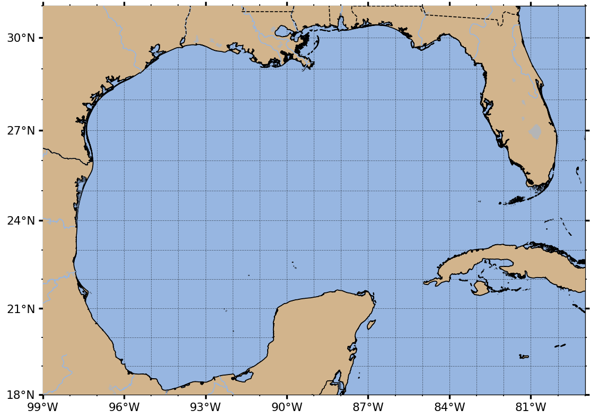
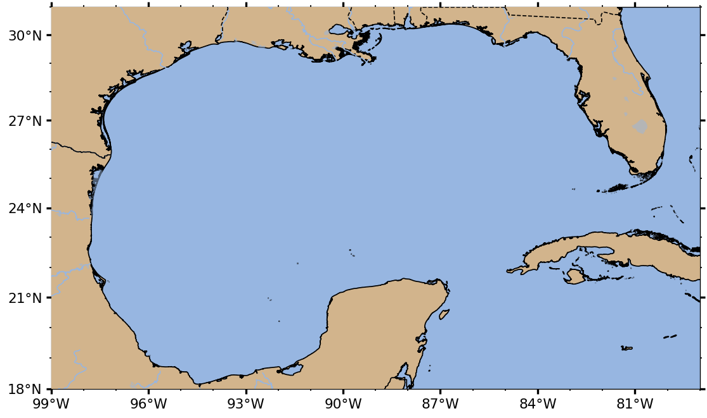
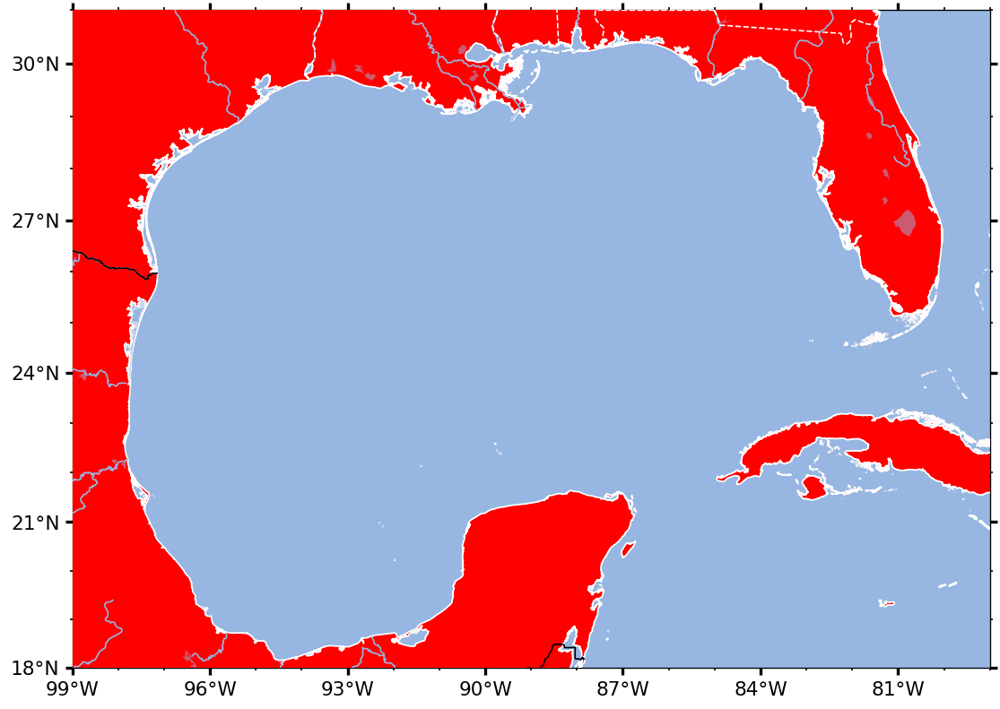
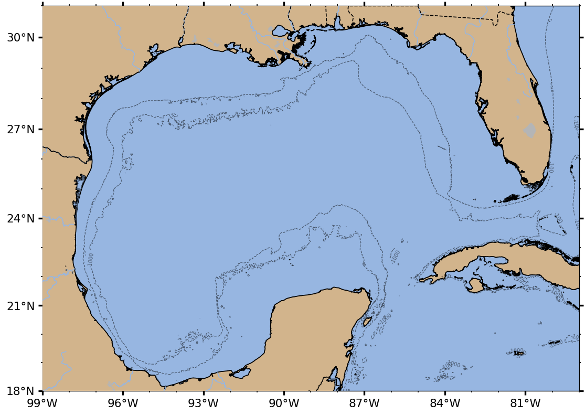
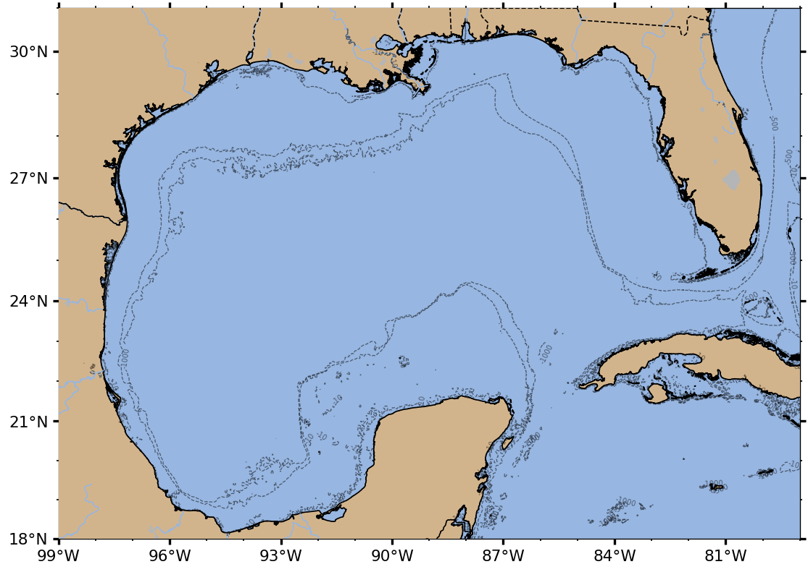
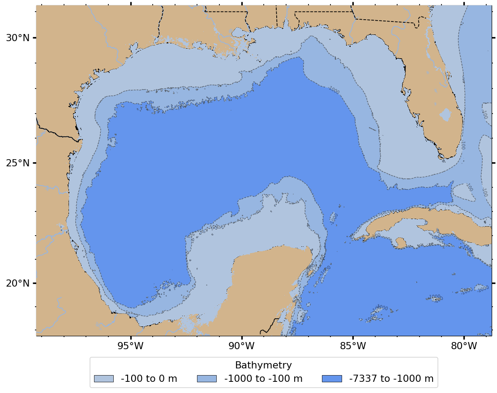
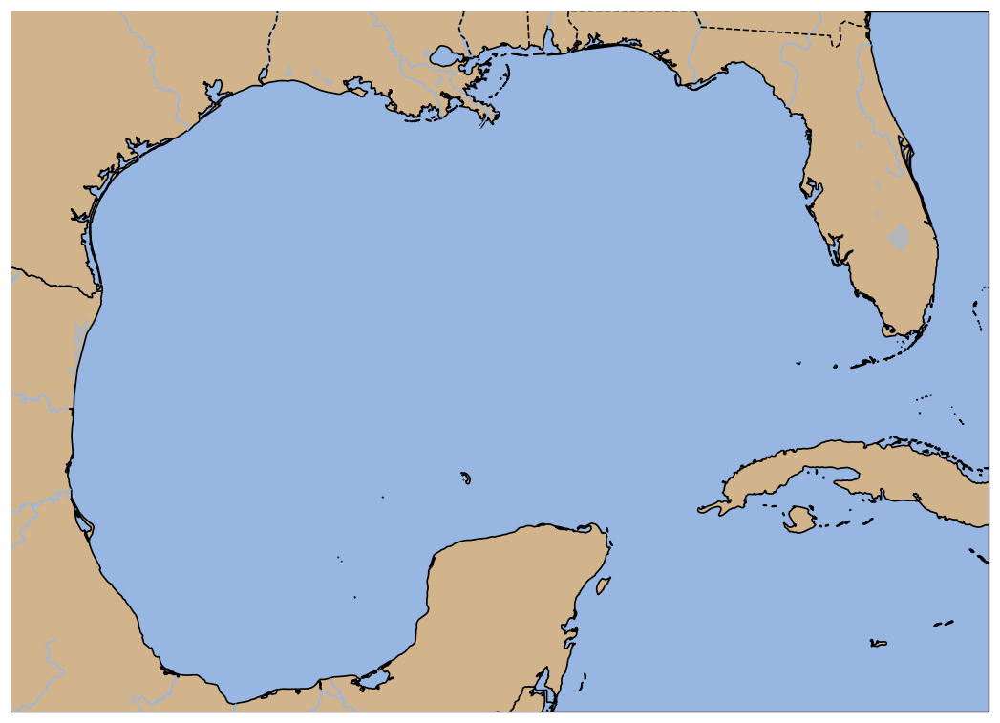

========
Tutorial
========

This page is a complete walkthrough of ``cool_maps``. A runnable version of the same material lives in
`notebooks/tutorial.ipynb <https://github.com/rucool/cool_maps/blob/main/notebooks/tutorial.ipynb>`_ in
the source repository.

Everything for making maps lives in ``cool_maps.plot``, conventionally imported as ``cplt``::

    import cool_maps.plot as cplt

    # Which mapping engines are importable in this environment, and which is active?
    cplt.available_engines()   # ('cartopy', 'basemap') or ('cartopy',)
    cplt.get_engine()          # 'cartopy'

If ``available_engines()`` only shows ``('cartopy',)``, that's fine -- Cartopy is the default and only
required engine. Basemap is optional (see :ref:`engines` below); everything in this tutorial up through
:ref:`overlaying-data` works identically either way.

Your first map
==============

Every map starts with an **extent**: the bounding box you want to plot, as
``(lon_min, lon_max, lat_min, lat_max)``. The only required argument to :func:`cplt.create` is ``extent``
-- everything else has a sensible default: tan land, blue ocean, black coastlines, automatically spaced
ticks, and rivers/lakes/state and country borders drawn in for you::

    # Gulf of Mexico
    extent = [-99, -79, 18, 31]

    fig, ax = cplt.create(extent, gridlines=True)

``create()`` returns ``(fig, ax)`` when it builds a new figure for you (as above), or just ``ax`` if you
pass in an existing axes with ``ax=``. ``ax`` is a normal matplotlib axes -- you can call any standard
matplotlib method on it (``ax.set_title(...)``, ``ax.legend()``, etc.) in addition to the
``cool_maps``-specific behavior described below.

By default, ``create()`` expands your ``extent`` outward by ``padding=0.25`` degrees on every side before
using it, so ticks (and any data you plot right at the edge of your bounding box) don't land exactly on
the border of the map. Pass a single number to change the amount, a ``(lon_padding, lat_padding)`` pair
for asymmetric padding, or ``padding=0`` to use ``extent`` exactly as given::

    cplt.create(extent, padding=0)                # no padding -- old behavior
    cplt.create(extent, padding=0.5)              # half a degree on every side
    cplt.create(extent, padding=(1, 0.25))        # 1 degree lon, 0.25 degree lat

The padded extent is what's actually used to build the axes, so it also determines the tick positions
(:func:`cplt.add_ticks`) and, when ``bathymetry=True``, the bounding box that's downloaded.

Projections
===========

Pass ``proj=`` to pick a map projection. ``cool_maps`` accepts either a plain string (works under any
engine) or, if you're using Cartopy, a real ``cartopy.crs`` object for full control.

Supported projection strings: ``"platecarree"``, ``"mercator"`` (the default), ``"lambertcylindrical"``,
``"mill"``, ``"orthographic"``, ``"lambertconformal"``, ``"stereographic"``, ``"azimuthequidistant"``::

    cplt.create(extent, proj="lambertcylindrical")

If you're using the Cartopy engine, you can also pass a real CRS object for full control over projection
parameters that the shared string form doesn't expose::

    import cartopy.crs as ccrs

    cplt.create(extent, proj=ccrs.AlbersEqualArea(central_longitude=-89))

Coastline resolution
=====================

``coast=`` controls how detailed the coastline/land polygons are. Higher resolution looks better for
regional maps but is slower to render.

======= =========================================
coast=  Use for
======= =========================================
full    Regional/coastal maps needing maximum detail (the default)
high    Regional maps where "full" is too slow
mid     Basin-scale maps
low     Ocean-basin or global maps
crude   Quick previews; omits rivers/state borders
======= =========================================

Colors
======

Three keywords control the map's color palette, independent of engine or projection:

* ``landcolor`` -- fill color for land (default ``"tan"``)
* ``oceancolor`` -- fill color for water (default: a Cartopy-style ocean blue)
* ``edgecolor`` -- coastline/border line color (default ``"black"``)

::

    cplt.create(extent, proj="mercator", landcolor="red", edgecolor="white")

Ticks and gridlines
====================

* ``ticks=True`` (default) computes nicely spaced tick positions from your extent, labeled in
  degrees-minutes-seconds by default.
* ``decimal_degrees=True`` switches the labels to plain decimal degrees.
* ``gridlines=True`` overlays a dashed grid at the tick positions.
* ``tick_label_left`` / ``_right`` / ``_bottom`` / ``_top`` control which sides carry labels.

Bathymetry
==========

Set ``bathymetry=True`` to download bathymetry data (GEBCO, via the Rutgers ERDDAP/THREDDS server) for
your extent and overlay it. ``isobaths=`` picks which depths to contour, and ``bathymetry_method=`` picks
the rendering style:

================= ==============================================================
bathymetry_method Description
================= ==============================================================
contour (default) Black isobath lines at each depth in ``isobaths``
shadedcontour     Isobaths shaded from light to dark grey with depth, plus a legend
banded            Discrete depth bands filled with explicit colors, or a built-in default for
                  the 3-band case; plus the usual isobath lines/labels and a legend
blues             Continuous depth shading (Blues colormap); land masked out
blues_log         Same, with a log-transformed depth scale
topo              Continuous depth shading (cmocean ``topo`` colormap); land masked out
topofull          Same as ``topo``, but land elevation is shown too
================= ==============================================================

Bathymetry downloads are cached to disk after the first call, so repeated calls for the same extent are
fast. Very large extents are automatically split into 10-degree tiles before being requested from the
server (Rutgers THREDDS rejects single OpenDAP requests that are too large), then stitched back together
-- this is transparent when going through ``create()``. If you call ``get_bathymetry()`` directly, pass
``chunk_size=`` (in degrees) to change the tile size, or ``chunk_size=None`` to disable tiling::

    cplt.create(extent, proj="mercator", bathymetry=True)

::

    cplt.create(extent, proj="mercator", bathymetry=True, isobaths=(-1000, -500, -10))

``banded`` needs one more color than the number of ``isobaths``, ordered from deepest to shallowest (the
extra color is for the band from the data's minimum elevation down to the shallowest level). The default
``isobaths=(-1000, -100)`` produces exactly 3 bands, which has a built-in default color scheme (deep,
``cfeature.COLORS["water"]`` for the middle band, shallow) -- so it works with no ``bathymetry_colors=``
at all::

    cplt.create(extent, bathymetry=True, bathymetry_method="banded")

Pass ``bathymetry_colors=`` to customize it (any other ``isobaths`` length requires this, since there's
no default to guess from)::

    cplt.create(
        extent, bathymetry=True, bathymetry_method="banded",
        isobaths=(-3000, -1000, -100),
        bathymetry_colors=["navy", "cornflowerblue", "lightblue", "lightsteelblue"],
    )

.. _overlaying-data:

Overlaying your own data
=========================

``ax`` (returned by ``create()``) accepts plain longitude/latitude data directly on the usual matplotlib
plotting methods: ``scatter``, ``plot``, ``contour``, ``contourf``, ``pcolormesh``, ``quiver``, and
``fill``. ``cool_maps`` takes care of the coordinate-system detail behind the scenes (Cartopy needs a
``transform=`` keyword; Basemap needs ``latlon=True``) so you never have to think about it -- the same
call works regardless of which engine built the axes::

    fig, ax = cplt.create(extent, coast="low")
    sc = ax.scatter(lons, lats, c=sst_anom, cmap="RdBu_r", vmin=-3, vmax=3, s=20, zorder=200)
    cplt.add_colorbar(ax, sc, label="SST anomaly (°C)")

For point markers specifically, :func:`cplt.add_marker` is a thin convenience wrapper around the same
idea::

    cplt.add_marker(ax, lon=-87.5, lat=25.5, marker="*", color="gold", s=300, edgecolor="black")

:func:`cplt.add_currents` plots a quiver field from an ``xarray.Dataset`` containing ``u``/``v`` velocity
components on ``lon``/``lat`` (or ``x``/``y``) coordinates::

    cplt.add_currents(ax, ds, coarsen=3)

If your map already has a legend (e.g. from ``bathymetry_method="shadedcontour"`` or ``"banded"``) and you
want a second one for your own overlaid data, use :func:`cplt.add_legend` in place of ``ax.legend()`` --
a plain second ``ax.legend()`` call replaces the first legend outright. ``add_legend()`` preserves
whatever legend is already there (handling a couple of non-obvious matplotlib details involved in doing
that correctly) before creating the new one, so you can call it repeatedly to build up any number of
legends on the same axes::

    sc = ax.scatter(argo_lon, argo_lat, marker="^", color="red", label="Argo surfacing")
    cplt.add_legend(ax, handles=[sc], loc="upper left")

See ``notebooks/banded_bathymetry_example.ipynb`` for a complete walkthrough, including how to
reposition each legend independently.

.. _engines:

Choosing between Cartopy and Basemap
======================================

Everything above works identically regardless of which engine is active. Cartopy is the default and the
only required dependency; Basemap is optional (``conda install -c conda-forge basemap basemap-data-hires``,
or ``pip install cool_maps[basemap]``).

There are three ways to pick an engine:

1. Per call, with ``engine=`` -- doesn't touch the global default::

    cplt.create(extent, engine="basemap")

2. Globally, for the rest of the session::

    cplt.set_engine("basemap")
    cplt.create(extent)   # uses basemap
    cplt.set_engine("cartopy")  # restore the default

3. Via the ``COOL_MAPS_ENGINE`` environment variable, set *before* you import ``cool_maps.plot``::

    COOL_MAPS_ENGINE=basemap python my_script.py

One more thing worth knowing: the axes returned by ``create()`` remembers which engine built it, so you
never need to pass ``engine=`` to ``add_features()`` / ``add_bathymetry()`` / ``add_currents()`` /
``add_ticks()`` yourself -- it's inferred from the axes automatically. You only need ``engine=`` when you
want to *override* what the axes would otherwise infer.

When switching engines you can keep using the same Cartopy CRS objects in calls such as
``cplt.create(..., proj=ccrs.Mercator())`` -- the Basemap backend will translate a handful of common
projections automatically. If a CRS cannot be converted, pass the Basemap projection name or keyword
dictionary instead (for example ``proj={'projection': 'lcc', 'lon_0': -74, 'lat_0': 39}``).

Building a map piece by piece
===============================

Setting ``features=False`` gives you a bare axes in the chosen projection, with none of the land/ocean/
border styling applied -- useful if you want full control, or want to apply the default styling with
different colors/resolution after the fact via :func:`cplt.add_features` (rather than reaching for
engine-specific methods like Cartopy's ``ax.add_feature()``, which won't work if the axes turns out to be
a Basemap axes)::

    fig, ax = cplt.create(extent, features=False, ticks=False)

    # add_features() is the engine-agnostic way to add the land/ocean/border styling back in,
    # with whatever customization you want -- it works no matter which engine built `ax`.
    cplt.add_features(ax, landcolor="tan", oceancolor=None, edgecolor="black", coast="high", zorder=0.1)

Saving your figures
=====================

:func:`cplt.export_fig` is a thin wrapper around ``plt.savefig()`` that trims the whitespace around the
plot::

    cplt.export_fig(save_path, "my_map.png")

:func:`cplt.save_fig` / :func:`cplt.load_fig` can pickle a whole figure for later reuse, but note that a
figure's engine-specific instrumentation (and, for Basemap, the attached ``Basemap`` object) is not
guaranteed to survive a pickle round-trip -- treat a reloaded figure's axes as plain matplotlib axes
rather than a fully re-instrumented ``cool_maps`` axes.

Where to go next
==================

* Full API reference: :doc:`modules`, or ``help(cplt)`` from a Python session.
* ``notebooks/dual_backend_demo.ipynb`` in the source repository -- a deeper dive into Cartopy/Basemap
  parity, including a performance comparison between the two engines.
* ``notebooks/engine_demo.ipynb`` -- a minimal smoke test that both engines render without errors.
