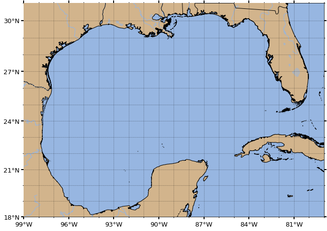
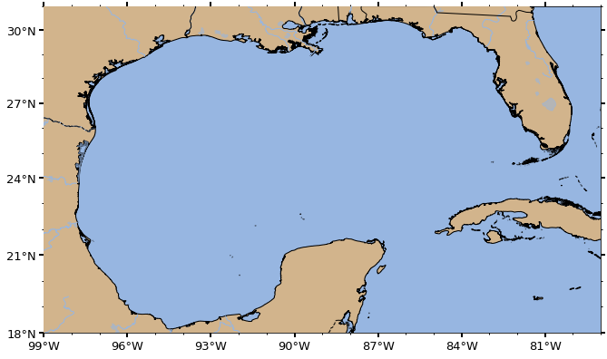
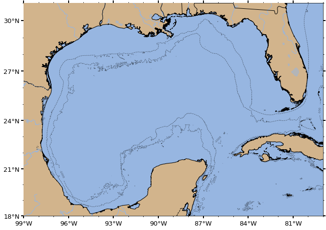
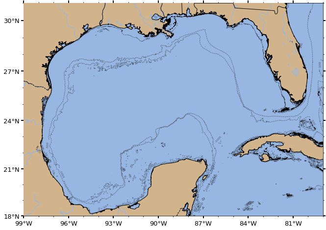
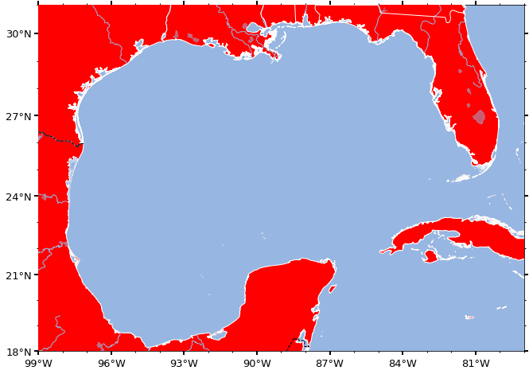
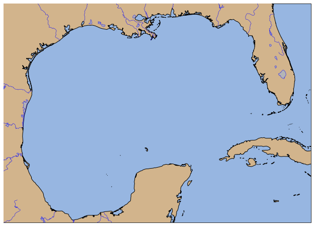

=====
Usage
=====

To import cool_maps in a project::

    import cool_maps.plot as cplt

Create a map using the default settings::
    
    cplt.create(extent, gridlines=True)

Change the map projection::

    import cartopy.crs as ccrs
    
    # Gulf of Mexico
    extent = [-99, -79, 18, 31]
    
    cplt.create(extent, proj=ccrs.LambertCylindrical())

Create a map with bathymetry with the default isobath of -1000 meters::
    
    cplt.create(extent, proj=ccrs.Mercator(), bathymetry=True)

Create a map with bathymetry with user-defined isobaths::
    
    cplt.create(extent, proj=ccrs.Mercator(), bathymetry=True, isobaths=(-1000, -500, -10))

Create a map with user-defined colors for land and the ocean::

    cplt.create(extent, proj=ccrs.Mercator(), landcolor='red', edgecolor='white')

Create a blank map. Setting features=False, will create a blank map, but still in the specified projection. We can fully customize the map afterwards.::
  
    import cartopy.feature as cfeature
    import matplotlib.pyplot as plt
    
    # Create an empty map in Mercator projection without the 'automatic features'
    fig, ax = cplt.create(extent, features=False, ticks=False)

    # Specify
    edgecolor="black"
    landcolor="tan"
    oceancolor=cfeature.COLORS['water'] #cfeature.COLORS['water'] is the standard 
    zorder=0.1

    state_lines = cfeature.NaturalEarthFeature(
        category='cultural',
        name='admin_1_states_provinces_lines',
        scale='50m',
        facecolor='none'
    )

    resol = '10m'
    land = cfeature.NaturalEarthFeature(
        'physical', 'land', resol,
        edgecolor='face',
        facecolor='tan'
    )
    lakes = cfeature.NaturalEarthFeature('physical', 'lakes', \
        scale=resol, edgecolor='b', facecolor=cfeature.COLORS['water'])
    rivers = cfeature.NaturalEarthFeature('physical', 'rivers_lake_centerlines', \
        scale=resol, edgecolor='b', facecolor='none')
    bodr = cfeature.NaturalEarthFeature(category='cultural', 
        name='admin_0_boundary_lines_land', scale=resol, facecolor='none', alpha=0.7)

    # # Axes properties and features
    ax.set_facecolor(oceancolor) # way faster than adding the ocean feature above
    ax.set_extent(extent)
    ax.add_feature(land, 
                edgecolor=edgecolor, 
                facecolor=landcolor,
                zorder=zorder+10)
    ax.add_feature(lakes, zorder=zorder+10.2, alpha=0.5)
    ax.add_feature(rivers, linewidth=0.5, zorder=zorder+10.2)
    ax.add_feature(bodr, linestyle='--', edgecolor='k', alpha=1)
    plt.show()

